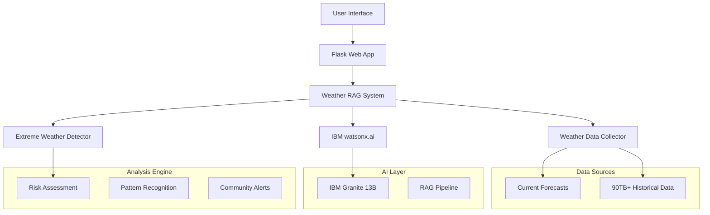

# 🌪️ Extreme Weather RAG System

**AI-Powered Climate Emergency Response Platform**  
*Built for IBM watsonx.ai Hackathon - Climate Challenge*

[](https://www.ibm.com/watsonx)
[](https://python.org)
[](https://flask.palletsprojects.com)
[](LICENSE)

---

## 🎯 Project Overview

The **Extreme Weather RAG System** is an intelligent early warning platform that combines real-time weather monitoring, historical data analysis, and AI-powered insights to predict and alert communities about dangerous weather events. Using IBM watsonx.ai's Granite models and 90+ TB of historical weather data, our system provides life-saving predictions and actionable guidance for extreme weather preparedness.

### 🏆 Hackathon Theme: Climate Challenge
Our solution addresses the urgent need for AI-driven climate adaptation tools that can save lives and protect communities from increasingly severe weather events.

---

## 👥 Team Members - CodeX

- **Nihal Ranchod** NRanchod@datacentrix.co.za
- **Eza Ngam** ENgam@datacentrix.co.za
- **Manisha Nankoo** MNankoo@datacentrix.co.za
- **Zakaria Motala** ZMotala@datacentrix.co.za

---

## ✨ Key Features

### 🤖 AI-Powered Analysis
- **IBM watsonx.ai Integration**: Granite models for intelligent weather pattern analysis
- **RAG Architecture**: Retrieval-Augmented Generation for context-aware predictions
- **Natural Language Interface**: Chat with the AI about weather conditions worldwide

### 🌍 Global Coverage
- **Any Location Worldwide**: Smart geocoding with OpenStreetMap integration
- **90+ TB Historical Data**: Weather patterns from 1940-present via Open-Meteo API
- **Real-time Monitoring**: 7-day forecasts with hourly precision

### ⚡ Extreme Weather Detection
- **Hurricane/Typhoon Tracking**: Advanced cyclonic storm prediction
- **Tornado Risk Assessment**: Atmospheric instability analysis
- **Heat Wave/Cold Wave Alerts**: Temperature extreme identification
- **Flash Flood Warnings**: Precipitation-based risk modeling
- **Severe Storm Tracking**: Thunderstorm and hail prediction

### 📱 User Experience
- **Real-time Chat Interface**: WebSocket-powered instant communication
- **Community Alerts**: Plain-language emergency notifications
- **Mobile-Responsive Design**: Works on any device
- **Command System**: Quick analysis with simple commands

---

## 🏗️ System Architecture



---

## 🚀 Quick Start

### Prerequisites
- Python 3.8+
- IBM watsonx.ai account with API access
- Basic knowledge of Flask/web development

### 1. Clone Repository
```bash
git clone https://github.com/your-team/extreme-weather-rag.git
cd extreme-weather-rag
```

### 2. Install Dependencies
```bash
pip install -r requirements.txt
```

### 3. Configure API Credentials
Create a `.env` file:
```env
WATSONX_API_KEY=your_watsonx_api_key_here
WATSONX_PROJECT_ID=your_project_id_here
WATSONX_ENDPOINT=https://us-south.ml.cloud.ibm.com
```

### 4. Run the Application
```bash
python app.py
```

### 5. Access the Interface
Open your browser to `http://localhost:5000`

---

## 📖 Usage Guide

### Commands
- `/analyze [location]` - Comprehensive weather risk analysis
- `/predict [coordinates]` - Location-based prediction
- `/monitor [location]` - Start continuous monitoring
- `/help` - Show all available commands

### Example Queries
```
🌀 Hurricane risk for Miami this week?
🌪️ Tornado warnings for Oklahoma City?
🌡️ Heat wave predictions for Phoenix?
📍 /predict 25.7617 -80.1918
⚡ /analyze Tokyo, Japan
```

### Natural Language Processing
The system understands natural language:
- "What's the weather like in Sydney?"
- "Are there any storm warnings for London?"
- "Show me hurricane predictions for the Gulf Coast"

---

## 🔧 Technical Implementation

### Core Components

#### 1. Weather Data Collection (`WeatherDataCollector`)
- **Historical Data**: Open-Meteo Archive API (1940-present)
- **Forecast Data**: 7-day predictions with hourly resolution
- **Global Coverage**: Any coordinate worldwide
- **Data Points**: Temperature, wind, precipitation, pressure, humidity

#### 2. Extreme Weather Detection (`ExtremeWeatherDetector`)
- **Pattern Recognition**: Statistical analysis of weather trends
- **Risk Scoring**: 1-10 scale for threat assessment
- **Event Classification**: Hurricane, tornado, heat wave, flood, etc.
- **Confidence Metrics**: Prediction reliability scores

#### 3. IBM watsonx.ai Integration (`WatsonxAIIntegration`)
- **Model**: IBM Granite 13B Instruct v2
- **RAG Pipeline**: Context-aware response generation
- **Community Alerts**: Plain-language emergency notifications
- **Historical Insights**: Climate pattern analysis

#### 4. Flask Web Application (`app.py`)
- **Real-time Chat**: WebSocket communication
- **Global Geocoding**: Smart location resolution
- **Responsive UI**: Mobile-friendly interface
- **Error Handling**: Graceful fallbacks and recovery

### Data Flow
1. **User Input** → Natural language or command processing
2. **Location Resolution** → Geocoding to coordinates
3. **Data Retrieval** → Historical + forecast weather data
4. **Pattern Analysis** → Extreme weather detection
5. **AI Processing** → watsonx.ai analysis and insights
6. **Response Generation** → Formatted user-friendly output

---

## 🌍 Impact & Use Cases

### Community Emergency Response
- **Early Warning Systems**: Automated alerts for high-risk weather
- **Emergency Planning**: Data-driven evacuation and shelter decisions
- **Resource Allocation**: Predictive deployment of emergency services

### Climate Adaptation
- **Infrastructure Planning**: Long-term risk assessment for development
- **Agricultural Support**: Crop protection and harvest timing
- **Insurance Analytics**: Risk modeling for climate-related claims

### Educational Outreach
- **Climate Awareness**: Interactive learning about weather patterns
- **Community Preparedness**: Training and emergency preparedness
- **Scientific Communication**: Making complex data accessible

---

## 🛠️ Development

### Project Structure
```
extreme-weather-rag/
├── app.py                 # Main Flask application
├── requirements.txt       # Python dependencies
├── .env                  # Environment variables (create this)
├── .gitignore           # Git ignore rules
├── src/
│   ├── config.py        # Configuration settings
│   └── weather_rag_system.py  # Core RAG system
├── static/
│   ├── css/style.css    # Styling
│   └── js/chat.js       # Frontend JavaScript
├── templates/
│   └── index.html       # Main HTML template
├── logs/                # Application logs
└── docs/               # Documentation and images
```

### Development Setup
1. **Virtual Environment**:
   ```bash
   python -m venv venv
   source venv/bin/activate  # On Windows: venv\Scripts\activate
   ```

2. **Development Mode**:
   ```bash
   export FLASK_DEBUG=1  # On Windows: set FLASK_DEBUG=1
   python app.py
   ```

3. **Testing**:
   ```bash
   # Test weather API connection
   python -c "from src.weather_rag_system import WeatherDataCollector; print('API Test:', bool(WeatherDataCollector().get_current_forecast(40.7, -74.0)))"
   ```
---

## 📝 API Documentation

### Core Endpoints

#### Weather Analysis
```python
POST /api/analyze
{
    "location": "Miami, FL",
    "days_history": 30
}
```

#### Real-time Predictions
```python
POST /api/predict
{
    "latitude": 25.7617,
    "longitude": -80.1918,
    "forecast_days": 7
}
```

#### System Health
```python
GET /api/health
Response: {
    "status": "healthy",
    "rag_system_ready": true,
    "timestamp": "2025-05-30T..."
}
```

---

## 🔒 Security & Privacy

### Data Protection
- **No Personal Data Storage**: Location queries are not logged
- **API Key Security**: Environment variable configuration
- **Rate Limiting**: Prevents API abuse
- **Input Validation**: Sanitized user inputs

### Compliance
- **Open Data Sources**: Publicly available weather information
- **Privacy by Design**: Minimal data collection
- **Transparent AI**: Explainable prediction logic

---

## 📜 License & Attribution

### License
This project is licensed under the MIT License - see the [LICENSE](LICENSE) file for details.

### Data Sources
- **Weather Data**: [Open-Meteo API](https://open-meteo.com/) - Open source weather API
- **Geocoding**: [OpenStreetMap Nominatim](https://nominatim.org/) - Free geocoding service
- **AI Models**: [IBM watsonx.ai](https://www.ibm.com/watsonx) - Granite foundation models

### Acknowledgments
- IBM watsonx.ai team for providing AI infrastructure
- Open-Meteo for comprehensive weather data access
- OpenStreetMap community for global geocoding services
- Flask and SocketIO communities for web framework support

---


*Built with ❤️ for the IBM watsonx.ai Hackathon - Climate Challenge*  
*© 2025 [CodeX]. Making communities safer through AI-powered weather intelligence.*